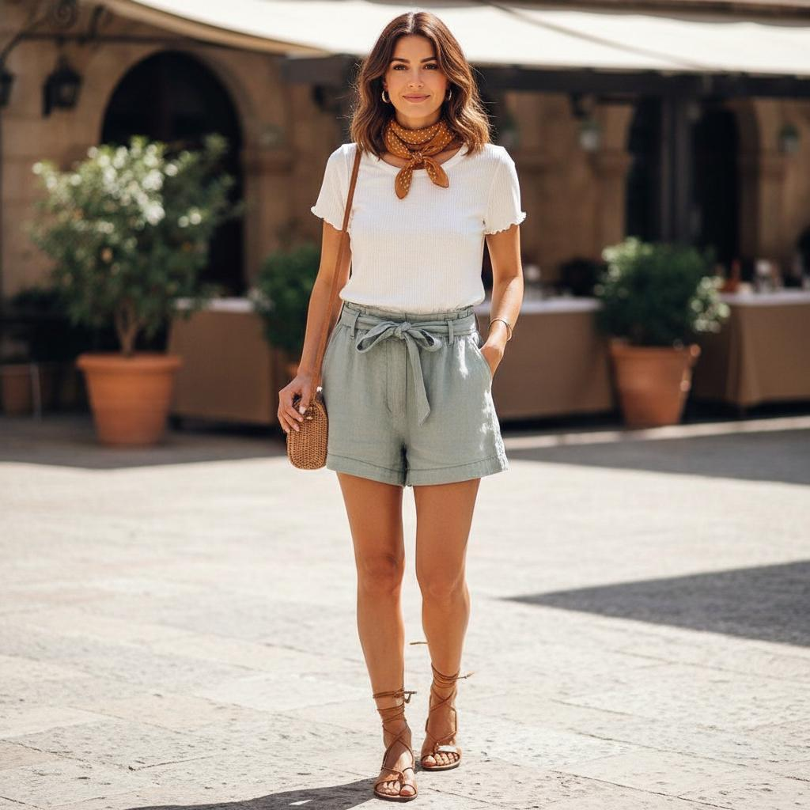

# 🍌 Awesome Nano Banana Images ✨

A curated collection of **Nano Banana**–themed AI-generated images and prompts.

<strong>If you like it, give it a star ⭐ to support!</strong>

---

<a id="table-of-contents"></a>

## Table of Contents

- [🍌 What is Nano Banana?](#nano-banana-intro)
- [📚 Cases Directory](#cases-directory)
- [🗂️ Cases](#cases)

---

<a id="nano-banana-intro"></a>

## 🍌 What is Nano Banana?

Nano Banana is Google’s new AI image editing model (officially part of Gemini 2.5 Flash Image) that lets users edit existing photos using simple text prompts—like “change hairstyle” or “add a background”—while preserving the subject’s likeness and scene consistency across edits. It delivers edits with high fidelity and speed, and is now accessible via the Gemini app for both free and paid users.

---

<a id="cases-directory"></a>

## 📚 Cases Directory

- [Case 1: Flat Lay to Outfit Preview](#case-1)
- [Case 2: Illustration to 1/7-Scale Figure](#case-2)
- [Case 3: Stick‑Figure Pose Composition Reference](#case-3)
- [Case 4: Professional Studio Photoshoot](#case-4)
- [Case 5: AI outfit try-on and swap](#case-5)

---

<a id="cases"></a>

## 🗂️ Case

[⬆️ Back to Cases Directory](#cases-directory)

<a id="case-1"></a>

### Case 1: Flat Lay to Outfit Preview (by [@levelsio](https://x.com/levelsio/status/1960902857722617892))

  

**Prompt**

```
show woman wearing the outfit
```

---

[⬆️ Back to Cases Directory](#cases-directory)

<a id="case-2"></a>

### Case 2: Illustration to 1/7-Scale Figure

 

**Prompt**

```
Use the nano-banana model to create a 1/7 scale model, in a realistic style and environment. Place the figure on a computer desk, using a circular transparent acrylic base without any text. On the computer screen, display the ZBrush modeling process of the figure. Next to the computer screen, place a TAMIYA-style toy packaging box printedwith the original artwork.
```

---

[⬆️ Back to Cases Directory](#cases-directory)

<a id="case-3"></a>

### Case 3: Stick‑Figure Pose Composition Reference (by [@yachimat_manga](https://x.com/yachimat_manga/status/1960471174758195494))


**Prompt**

```
Generate an intense, action‑packed fight scene between two characters, choreographed from stick‑figure poses.
```

---

[⬆️ Back to Cases Directory](#cases-directory)

<a id="case-4"></a>

### Case 4: Professional Studio Photoshoot (by [@ZHO_ZHO_ZHO](https://x.com/ZHO_ZHO_ZHO/status/1961024423596872184))


**Prompt**

```
Have the subject in Image 1 assume the pose from Image 2, photographed in a professional studio.
```

---

[⬆️ Back to Cases Directory](#cases-directory)

<a id="case-5"></a>

### Case 5: AI outfit try-on and swap (by [@ai_for_success](https://x.com/ai_for_success/status/1961255719480525275))


**Prompt**

```
make model from image 1 wear the dress from image 2.
```
